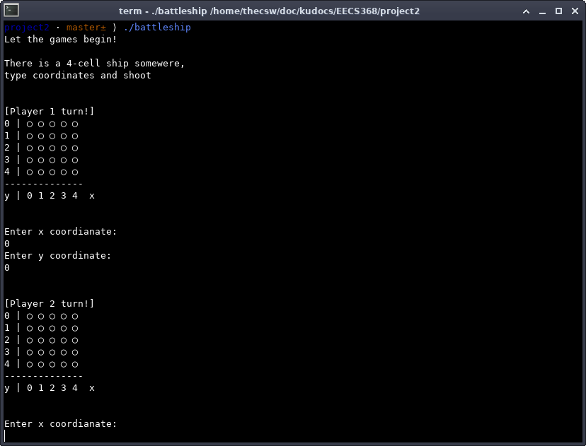
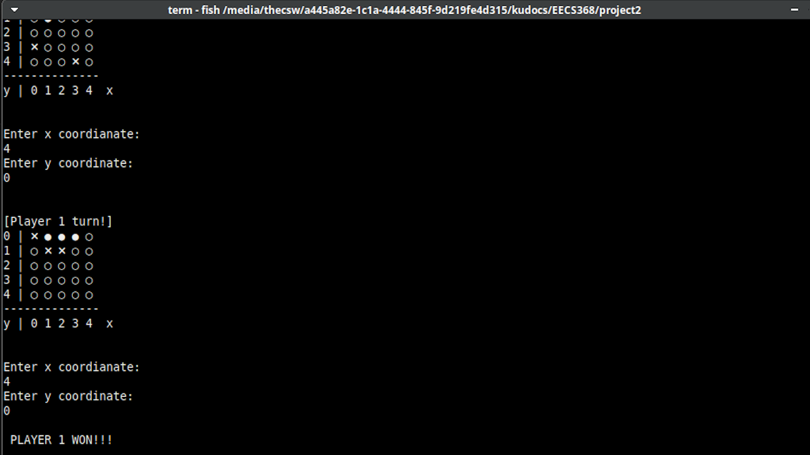

****Documentation****
=====================

The inputs for each player is the x and y coordinate of opponent\'s
board that they want to shoot. By default, it allocates a 5x5 board for
both players and ships located in different locations. Screenshots can
be found in this document and the game\'s full output can also be found
below.

****Checklist****
=================

-   ✅Looking for basic Haskell know-how, in the form of a simple program
    of (cut down) battleship.
-   ✅5x5 grid ****and a Haskell representation of the grid****
-   ✅1x4 boat/ship, placed at fixed location via a function (or other
    user).
-   ✅user can guess via responses
-   ✅computer checks, reports.
-   ✅visuals help.
-   ✅Optional: set number of rounds
-   ✅Document what input works.
-   ✅Document what you\'ve tested with.
-   ✅What examples have you used to test your code.

****Screenshots****
===================

****Full output****
===================

     (master *$*)$ ./battleship
    Let the games begin!

    There is a 4-cell ship somewere,
    type coordinates and shoot

    [Player 1 turn!]
    0 | ◯ ◯ ◯ ◯ ◯ 
    1 | ◯ ◯ ◯ ◯ ◯ 
    2 | ◯ ◯ ◯ ◯ ◯ 
    3 | ◯ ◯ ◯ ◯ ◯ 
    4 | ◯ ◯ ◯ ◯ ◯ 
    --------------
    y | 0 1 2 3 4  x 

    Enter x coordianate: 
    2
    Enter y coordinate: 
    0

    [Player 2 turn!]
    0 | ◯ ◯ ◯ ◯ ◯ 
    1 | ◯ ◯ ◯ ◯ ◯ 
    2 | ◯ ◯ ◯ ◯ ◯ 
    3 | ◯ ◯ ◯ ◯ ◯ 
    4 | ◯ ◯ ◯ ◯ ◯ 
    --------------
    y | 0 1 2 3 4  x 

    Enter x coordianate: 
    0
    Enter y coordinate: 
    0

    [Player 1 turn!]
    0 | ◯ ◯ ● ◯ ◯ 
    1 | ◯ ◯ ◯ ◯ ◯ 
    2 | ◯ ◯ ◯ ◯ ◯ 
    3 | ◯ ◯ ◯ ◯ ◯ 
    4 | ◯ ◯ ◯ ◯ ◯ 
    --------------
    y | 0 1 2 3 4  x 

    Enter x coordianate: 
    1
    Enter y coordinate: 
    0

    [Player 2 turn!]
    0 | ❌◯ ◯ ◯ ◯ 
    1 | ◯ ◯ ◯ ◯ ◯ 
    2 | ◯ ◯ ◯ ◯ ◯ 
    3 | ◯ ◯ ◯ ◯ ◯ 
    4 | ◯ ◯ ◯ ◯ ◯ 
    --------------
    y | 0 1 2 3 4  x 

    Enter x coordianate: 
    3
    Enter y coordinate: 
    4

    [Player 1 turn!]
    0 | ◯ ● ● ◯ ◯ 
    1 | ◯ ◯ ◯ ◯ ◯ 
    2 | ◯ ◯ ◯ ◯ ◯ 
    3 | ◯ ◯ ◯ ◯ ◯ 
    4 | ◯ ◯ ◯ ◯ ◯ 
    --------------
    y | 0 1 2 3 4  x 

    Enter x coordianate: 
    1
    Enter y coordinate: 
    1

    [Player 2 turn!]
    0 | ❌◯ ◯ ◯ ◯ 
    1 | ◯ ◯ ◯ ◯ ◯ 
    2 | ◯ ◯ ◯ ◯ ◯ 
    3 | ◯ ◯ ◯ ◯ ◯ 
    4 | ◯ ◯ ◯ ❌◯ 
    --------------
    y | 0 1 2 3 4  x 

    Enter x coordianate: 
    0
    Enter y coordinate: 
    3

    [Player 1 turn!]
    0 | ◯ ● ● ◯ ◯ 
    1 | ◯ ❌◯ ◯ ◯ 
    2 | ◯ ◯ ◯ ◯ ◯ 
    3 | ◯ ◯ ◯ ◯ ◯ 
    4 | ◯ ◯ ◯ ◯ ◯ 
    --------------
    y | 0 1 2 3 4  x 

    Enter x coordianate: 
    3
    Enter y coordinate: 
    0

    [Player 2 turn!]
    0 | ❌◯ ◯ ◯ ◯ 
    1 | ◯ ◯ ◯ ◯ ◯ 
    2 | ◯ ◯ ◯ ◯ ◯ 
    3 | ❌◯ ◯ ◯ ◯ 
    4 | ◯ ◯ ◯ ❌◯ 
    --------------
    y | 0 1 2 3 4  x 

    Enter x coordianate: 
    3
    Enter y coordinate: 
    0

    [Player 1 turn!]
    0 | ◯ ● ● ● ◯ 
    1 | ◯ ❌◯ ◯ ◯ 
    2 | ◯ ◯ ◯ ◯ ◯ 
    3 | ◯ ◯ ◯ ◯ ◯ 
    4 | ◯ ◯ ◯ ◯ ◯ 
    --------------
    y | 0 1 2 3 4  x 

    Enter x coordianate: 
    2
    Enter y coordinate: 
    1

    [Player 2 turn!]
    0 | ❌◯ ◯ ❌◯ 
    1 | ◯ ◯ ◯ ◯ ◯ 
    2 | ◯ ◯ ◯ ◯ ◯ 
    3 | ❌◯ ◯ ◯ ◯ 
    4 | ◯ ◯ ◯ ❌◯ 
    --------------
    y | 0 1 2 3 4  x 

    Enter x coordianate: 
    0
    Enter y coordinate: 
    0

    [Player 1 turn!]
    0 | ◯ ● ● ● ◯ 
    1 | ◯ ❌❌◯ ◯ 
    2 | ◯ ◯ ◯ ◯ ◯ 
    3 | ◯ ◯ ◯ ◯ ◯ 
    4 | ◯ ◯ ◯ ◯ ◯ 
    --------------
    y | 0 1 2 3 4  x 

    Enter x coordianate: 
    0
    Enter y coordinate: 
    0

    [Player 2 turn!]
    0 | ❌◯ ◯ ❌◯ 
    1 | ◯ ◯ ◯ ◯ ◯ 
    2 | ◯ ◯ ◯ ◯ ◯ 
    3 | ❌◯ ◯ ◯ ◯ 
    4 | ◯ ◯ ◯ ❌◯ 
    --------------
    y | 0 1 2 3 4  x 

    Enter x coordianate: 
    1
    Enter y coordinate: 
    1

    [Player 1 turn!]
    0 | ❌● ● ● ◯ 
    1 | ◯ ❌❌◯ ◯ 
    2 | ◯ ◯ ◯ ◯ ◯ 
    3 | ◯ ◯ ◯ ◯ ◯ 
    4 | ◯ ◯ ◯ ◯ ◯ 
    --------------
    y | 0 1 2 3 4  x 

    Enter x coordianate: 
    1
    Enter y coordinate: 
    1

    [Player 2 turn!]
    0 | ❌◯ ◯ ❌◯ 
    1 | ◯ ● ◯ ◯ ◯ 
    2 | ◯ ◯ ◯ ◯ ◯ 
    3 | ❌◯ ◯ ◯ ◯ 
    4 | ◯ ◯ ◯ ❌◯ 
    --------------
    y | 0 1 2 3 4  x 

    Enter x coordianate: 
    4
    Enter y coordinate: 
    0

    [Player 1 turn!]
    0 | ❌● ● ● ◯ 
    1 | ◯ ❌❌◯ ◯ 
    2 | ◯ ◯ ◯ ◯ ◯ 
    3 | ◯ ◯ ◯ ◯ ◯ 
    4 | ◯ ◯ ◯ ◯ ◯ 
    --------------
    y | 0 1 2 3 4  x 

    Enter x coordianate: 
    4
    Enter y coordinate: 
    0

     PLAYER 1 WON!!!
